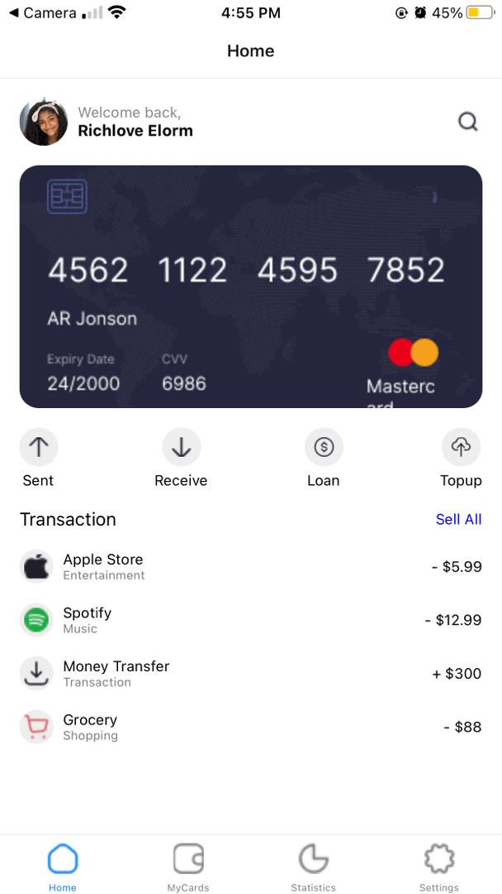
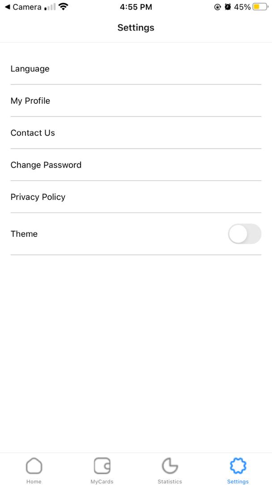
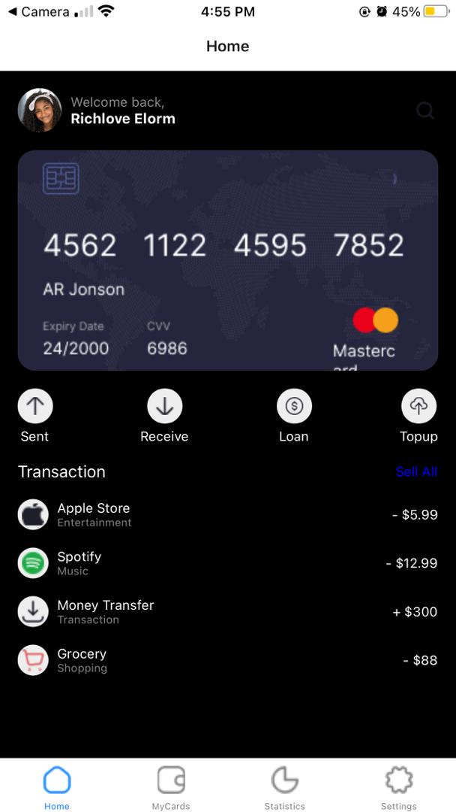
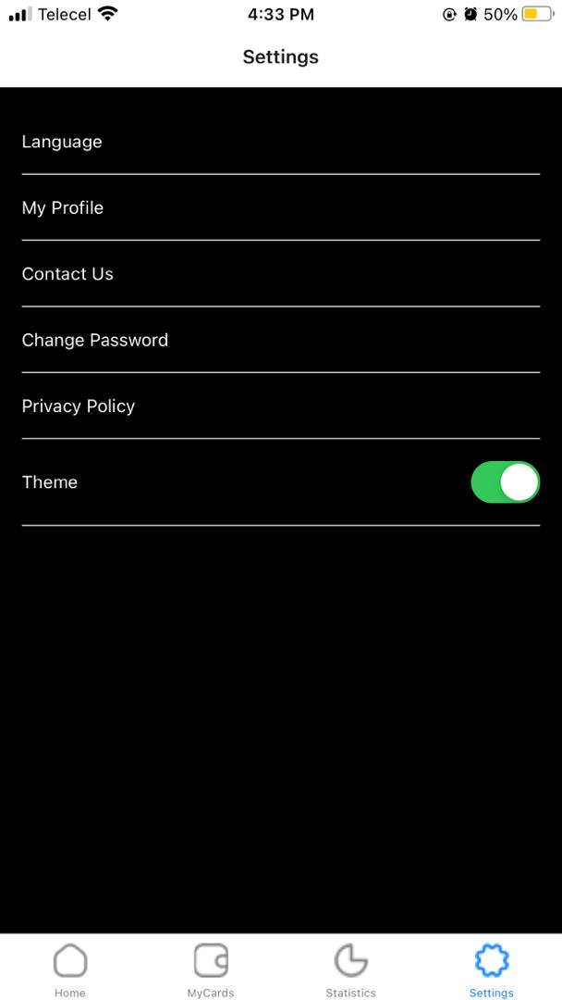
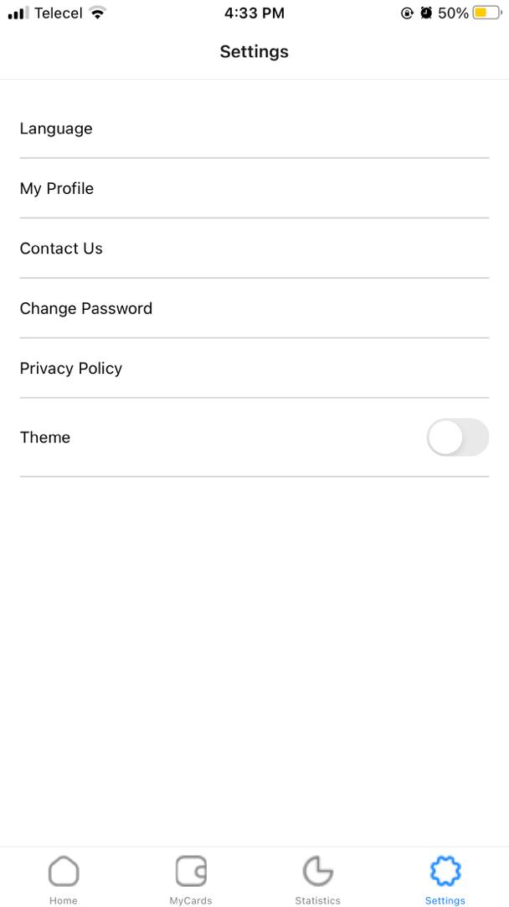

My React Native Mobile App
Overview
This React Native mobile application, built using Expo, features a Home Screen and a Settings Screen. The Home Screen displays an image of the card used for transactions and a list of transactions made. The app includes tab navigation for easy switching between screens and a toggle switch for changing between light and dark theme modes.

Features
Home Screen: Displays an image of the transaction card and a list of transactions.
Settings Screen: Allows users to modify app settings.
Tab Navigation: Easy switching between Home Screen and Settings Screen.
Theme Toggle: Switch between light and dark theme modes.
Installation
To get started with the app, follow these steps:

Clone the repository to your local machine.
Navigate to the project directory.
Install the necessary dependencies using a package manager like npm or yarn.
Start the Expo development server.
Use the Expo Go app on your mobile device or an emulator to view the app.
## Screenshots
 
 
 
 

Usage
Open the app on your mobile device or emulator.
On the Home Screen, view the card image and the list of transactions.
Use the tab navigation to switch to the Settings Screen.
Toggle the switch to change between light and dark theme modes.
Dependencies
React Native
Expo
React Navigation
Contributing
If you would like to contribute to the project, please fork the repository and submit a pull request. For major changes, please open an issue first to discuss what you would like to change.

License
This project is licensed under the MIT License.

